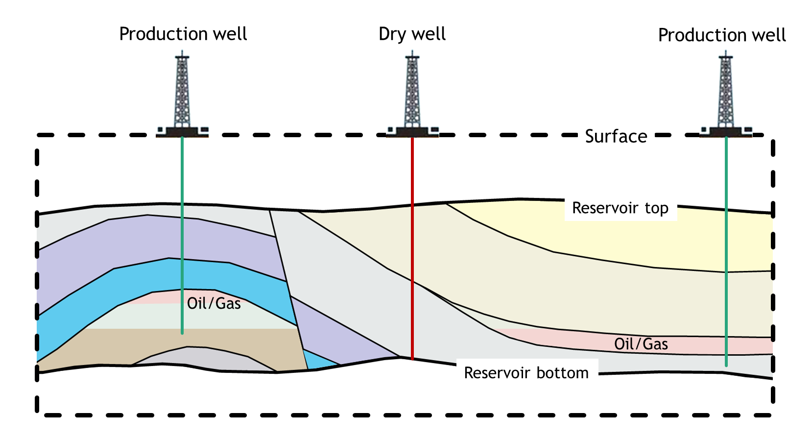
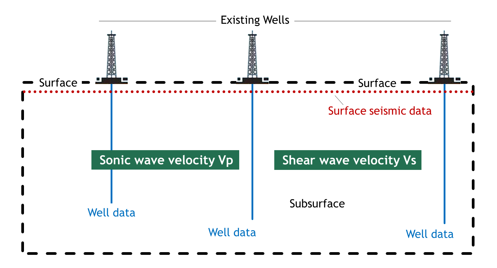

# Seismic elastic parameter estimation using Bayesian framework

## Introduction

The goal of this project is to use reflection seismic data and well logging data to estimate underground elastic parameters that are used for finding potential oil and gas reservoirs. By wrangling and analyzing well logging data in R, the missing well data can be estimated using Bayesian framework. And the Bayesian prior information can be obtained by using interpolation method. The Bayesian model is also derived. Finally, the user graphic interface for elastic parameters estimation is implemented in Python.

## Elastic parameters
Based on Bayesian inference theory, the elastic parameters that are used for estimation are the sonic wave velocity Vp and the shear wave velocity Vs. The ratio between the sonic wave velocity and the shear wave velocity is sensitive to the reservoir characterization.

<video controls="" width="800" height="500" muted="" loop="" autoplay="">
<source src="usr/demo.mov" type="video/mp4">
</video>
