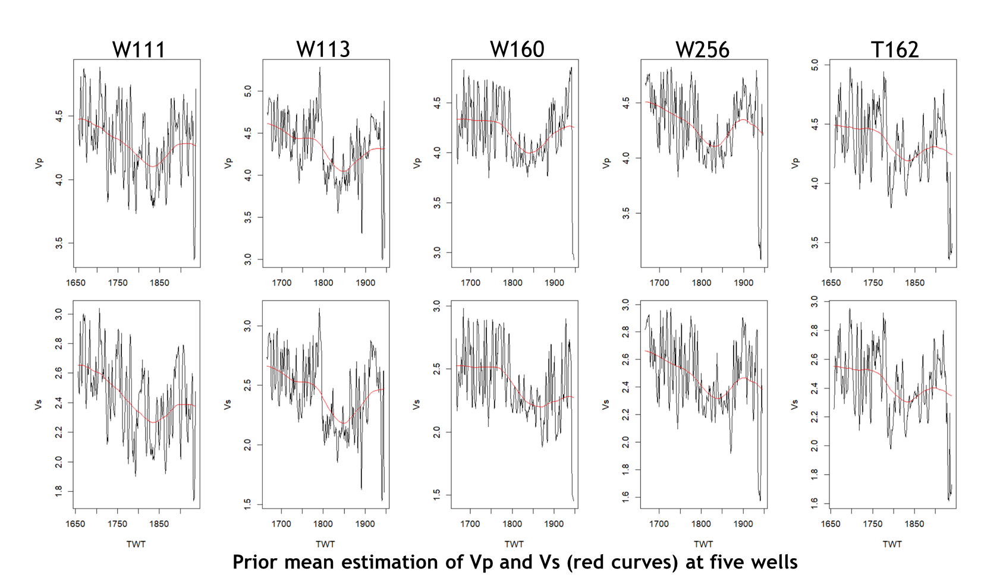

# Seismic elastic parameter estimation using Bayesian framework

## Introduction

The goal of this project is to use reflection seismic data and well logging data to estimate underground elastic parameters that are used for finding potential oil and gas reservoirs. By wrangling and analyzing well logging data in R, the missing well data can be estimated using Bayesian framework. And the Bayesian prior information can be obtained by using interpolation method. The Bayesian model is also derived. Finally, the user graphic interface for elastic parameters estimation is implemented in Python.

## Elastic Parameters
Based on Bayesian inference theory, the elastic parameters that are used for estimation are the sonic wave velocity Vp and the shear wave velocity Vs. The ratio between the sonic wave velocity and the shear wave velocity is sensitive to the reservoir characterization.

## Well Data Analysis and Missing Data Imputation
Five well logging data in this project are used to estimate the prior information for Bayesian inference. Four wells have both sonic logs (Vp) and shear logs (Vs). The shear log data are missing in well T162.

By wrangling and analyzing four complete well logging data, the missing shear log data are estimated using linear regression model of Bayesian framework in R.

## Prior Information Estimation
The Bayesian inference requires to estimate prior information that can be obtained by using interpolation method. First, the prior mean estimation of Vp and Vs (red curves) at five wells are calculated.

Then, the 1D prior at five wells can be interpolated to 2D.

## Bayesian Inference for Elastic Parameters
The elastic parameters that are used for Bayesian inference are the sonic wave velocity Vp and the shear wave velocity Vs. The likelihood function is using a geophysical convolution function: d = Cm(Vp, Vs). And the Bayesian model is defined as:

where d is the input seismic reflection data.

## Graphic User Interface (GUI) Development
The graphic user interface is developed using Python for easy data and computation management. The kernel algorithms of Bayesian inference are implemented by Fortran, C++ and shell scripts with efficient multi-level parallelization (OpenMP + MPI) and optimization on CPU multiprocessor platforms.

https://user-images.githubusercontent.com/110936252/184060747-2cb085bb-41d3-49f8-8b85-0d1e5b114db1.mov
